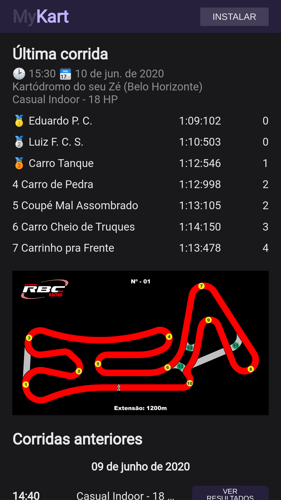

# MyKart

Aplicação para verificar os resultados da última corrida que ocorreu
no kartódromo e corridas anteriores no mesmo kartódromo.

Protótipo completo pode ser visto abrindo o arquivo **wireframe.drawio**
a partir do [Draw IO/App Diagrams ](https://app.diagrams.net/).

Para popular uma base de dados do firebase com dados fictícios, na pasta
bin há um script em node *seeddb*. É preciso colocar um arquivo json
com credenciais de conta de serviço do firebase na mesma pasta. Depois
é só rodar o script com `node seeddb` ou no linux `./seeddb`.

O projeto é um PWA. Pode ser instalado no computador ou telefone clicando
no botão **"Instalar"** ou pelo menu do navegador Firefox, Chrome ou Edge.

TODO:
colocar gif mostrando o funcionamento do aplicativo.

